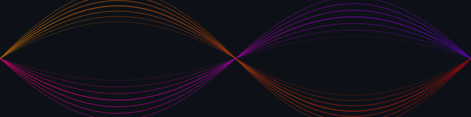

  
  
  

    
    
    
  

  

  <table width="100%">
    <tr>
      <td width="50%" align="center" valign="top">
        <h3 align="center">⚡ Tech Stack &amp; Tools</h3>
        
      </td>
      <td width="50%" align="center" valign="top">
        <h3 align="center">📊 System Analytics</h3>
        
         
        
      </td>
    </tr>
  </table>

  <h3 align="center">🐍 Contribution Protocol</h3>
  <picture>
    <source media="(prefers-color-scheme: dark)" srcset="https://raw.githubusercontent.com/muhammadhabib16/muhammadhabib16/output/github-contribution-grid-snake-dark.svg">
    <source media="(prefers-color-scheme: light)" srcset="https://raw.githubusercontent.com/muhammadhabib16/muhammadhabib16/output/github-contribution-grid-snake.svg">
    
  </picture>

  

